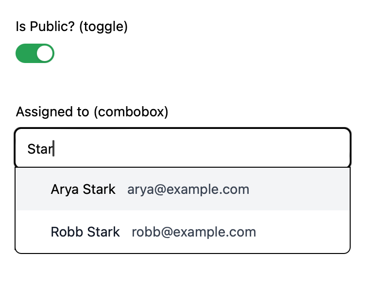

# Headless UI Components for Phoenix

Unstyled, accessible UI components for Phoenix and Phoenix LiveView.
To be styled with the CSS framework of your choice.

> [!WARNING]
> This project is in a very early stage - see [Components](#components) list below.



## Demo

[See demo website](https://headless.fly.dev)

## Goals & Rules

- Provide unstyled Phoenix components as building blocks for your own UI components
- If something can be achieved with HTML and CSS only, it should be done with HTML and CSS only (no-JS)
- Where JS is required, use [Alpine.js](http://alpinejs.dev)
- Use [`Alpine.data()`](https://alpinejs.dev/globals/alpine-data) instead of inline markup
- Components must work with standard Phoenix controllers (_dead_ views)
- Components must work with Phoenix LiveView
- Components must work with standard Phoenix forms
- Components must be accessible (aria attributes, keyboard navigation, focus, etc.)

## Components

| Component    | Functions         | Status         |
| ------------ | ----------------- | -------------- |
| Avatar       | `use_avatar/1`    | ✅ Done        |
| Checkbox     | `input/1`         | ✅ Done        |
| Clipboard    | `use_clipboard/1` | ✅ Done        |
| Combobox     | `use_combobox/1`  | 🏗️ In progress |
| Command      |                   | 🏗️ In progress |
| Dialog       |                   | 🗺️ Planned     |
| File Preview |                   | 🗺️ Planned     |
| Input OTP    |                   | 🗺️ Planned     |
| Popover      | `use_popover/1`   | ✅ Done        |
| Radio button |                   | 🗺️ Planned     |
| Tabs         |                   | 🗺️ Planned     |
| Text input   | `input/1`         | ✅ Done        |
| Textarea     |                   | 🗺️ Planned     |
| Toggle       | `use_toggle/1`    | ✅ Done        |

## Installation

The package can be installed by adding `headless` to your list of dependencies in `mix.exs`:

```elixir
def deps do
  [
    {:headless, "~> 0.1"}
  ]
end
```

Include JavaScript package in your `app.js`:

```js
// assets/js/app.js

// import and start headless
import headless from "headless"
headless.start()

// ...

// configure LiveSocket
let liveSocket = new LiveSocket('/live', Socket, {
  // ...

  // configure dom hook
  dom: headless.dom
})
```


## Usage

Headless components are meant to be used as building blocks for your own components.
Most components are built using `use_*` functions that expose the necessary HTML attributes
to provide the functionality leaving all tag rendering to the user.
This way every element can be 100% customized.

See [example app components](./apps/demo/lib/demo/components/core_components.ex).

```elixir
defmodule MyAppWeb.Components do
  use Phoenix.Component
  import Headless

  attr :src, :any
  attr :alt, :any
  attr :initials, :string

  def avatar(assigns) do
    ~H"""
    <.use_avatar :let={a} src={@src}>
      <div {a.root}>
        
        <div {a.fallback}><%= @initials %></div>
      </div>
    </.use_avatar>
    """
  end
end
```

## Adding your own Alpine components

If you want to add your own Alpine components you can import the bundled Alpine like this:

```js
// assets/js/app.js

import headless, { Alpine } from "headless"

Alpine.data("my_custom_component", () => ...)

headless.start()
```

## Development

```bash
# Start development server with examples
mix phx.server

# Update bundled Alpine
curl -L https://unpkg.com/@alpinejs/csp/dist/module.cjs.js > ./apps/headless/assets/vendor/alpine.js
```

## Inspirations

- [headless UI](https://headlessui.com)
- [Sprout UI](https://github.com/TunkShif/sprout_ui)
- [Zig](https://zagjs.com/)
