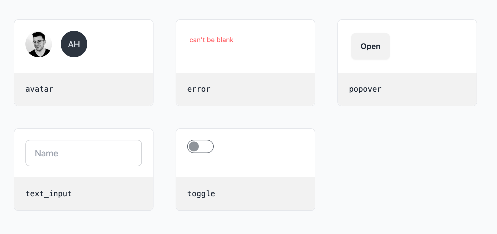

# Headless UI Components for Phoenix

Unstyled, accessible UI components for Phoenix and Phoenix LiveView.
To be styled with the CSS framework of your choice.



## Demo

[See demo website](https://headless.fly.dev)

## Goals & Rules

- Provide unstyled Phoenix components as building blocks for your own UI components
- If something can be achieved with HTML and CSS only, it should be done with HTML and CSS only (no-JS)
- Where JS is required, use [Alpine.js](http://alpinejs.dev)
- Use [`Alpine.data()`](https://alpinejs.dev/globals/alpine-data) instead of inline markup
- Components must work with standard Phoenix controllers (_dead_ views)
- Components must work with Phoenix LiveView
- Components must work with standard Phoenix forms
- Components must be accessible (aria attributes, keyboard navigation, focus, etc.)

## Components

| Component    | Functions        | Status         |
| ------------ | ---------------- | -------------- |
| Avatar       | `use_avatar/1`   | ✅ Done        |
| Checkbox     | `input/1`        | ✅ Done        |
| Clipboard    |                  | 🗺️ Planned     |
| Combobox     | `use_combobox/1` | 🏗️ In progress |
| Command      |                  | 🏗️ In progress |
| Dialog       |                  | 🗺️ Planned     |
| File Preview |                  | 🗺️ Planned     |
| Input OTP    |                  | 🗺️ Planned     |
| Popover      | `use_popover/1`  | ✅ Done        |
| Radio button |                  | 🗺️ Planned     |
| Tabs         |                  | 🗺️ Planned     |
| Text input   | `input/1`        | ✅ Done        |
| Textarea     |                  | 🗺️ Planned     |
| Toggle       | `use_toggle/1`   | ✅ Done        |

## Installation

The package can be installed by adding `headless` to your list of dependencies in `mix.exs`:

```elixir
def deps do
  [
    {:headless, "~> 0.1"}
  ]
end
```

## Usage

You should not use Headless components directly but use them as building blocks for your own components. Most components are built using `use_*` functions that provide the necessary HTML attributes to provide the functionality leaving all tag rendering to the user. This way every element can be 100% customized.

See [demo](demo) directory for styling examples.

```elixir
defmodule MyAppWeb.Components do
  use Phoenix.Component, global_prefixes: ~w(x-)
  import Headless

  attr :field, Phoenix.HTML.FormField

  def toggle(assigns) do
    ~H"""
    <.use_toggle :let={t}>
      <.input {t.input} field={@field} class="toggle" {@rest} />
    </.use_toggle>
    """
  end
end
```

## How to include JavaScript

You can include all headless components and the bundled Alpine.js with a single line:

```js
// assets/js/app.js
import headless from 'headless'
headless.start()
```

If you'd rather pick one a few components you can import them one by one:

```js
// assets/js/app.js

// import Alpine.js from headless or bring your own
import { Alpine } from 'headless'

// import components
import Avatar from 'headless/avatar'
import Clipboard from 'headless/clipboard'

// setup components
Avatar.register(Alpine)
Clipboard.register(Alpine)

// start Alpine
Alpine.start()
```

If you want to add your own components use this:


```js
// assets/js/app.js
import headless, { Alpine } from 'headless'

// register headless components
headless.register(Alpine)

// register your own components
Alpine.data("my-thing", () => { ... })

// start alpine
Alpine.start()
```


## Development

```bash
# Start development server with examples
mix phx.server
```

## Inspirations

- [headless UI](https://headlessui.com)
- [Sprout UI](https://github.com/TunkShif/sprout_ui)
- [Zig](https://zagjs.com/)
